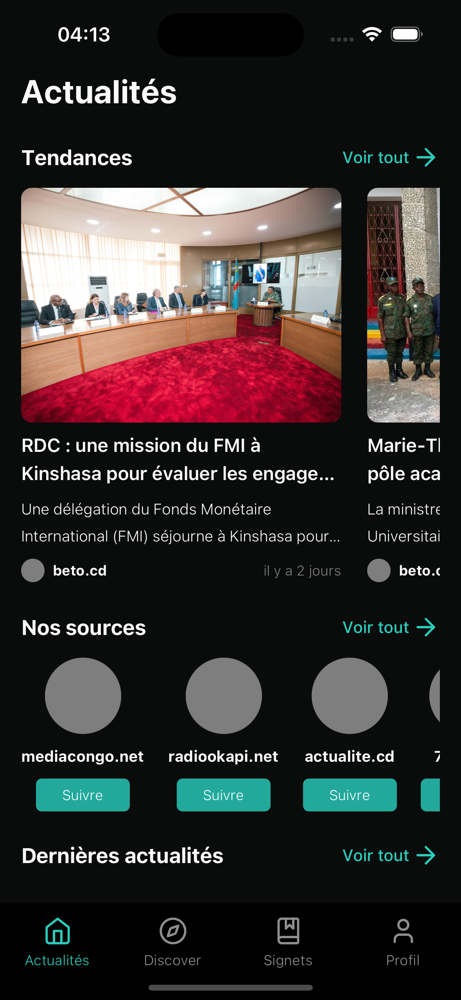
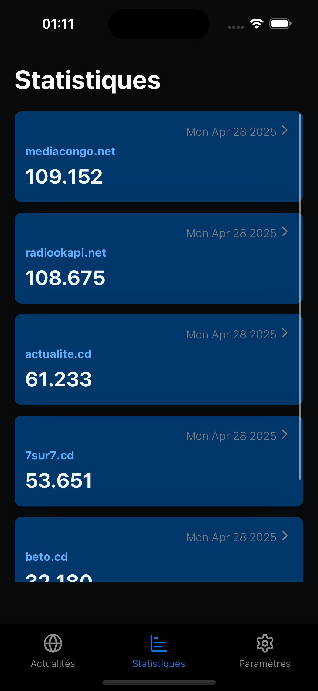

# Mobile Application

| Scope             | Link                                                       |
|-------------------|------------------------------------------------------------|
| core and backend  | https://github.com/bernard-ng/drc-news-corpus              |
| ML models         | https://github.com/bernard-ng/drc-news-ml                  |
| Mobile App        | https://github.com/bernard-ng/drc-news-app                 |
| Dataset (partial) | https://huggingface.co/datasets/bernard-ng/drc-news-corpus |

---

## DRC News Corpus : Towards a scalable and intelligent system for Congolese News curation

### Introduction

The **"DRC News Corpus"** is a structured and scalable dataset of news articles sourced from major media outlets covering diverse aspects of the Democratic Republic of Congo (DRC). Designed for efficiency, this system enables the automated collection, processing, and organization of news stories spanning politics, economy, society, culture, environment, and international affairs.

### Screenshots

&nbsp;
&nbsp;
&nbsp;

### Sources

| Source               | Articles | Link                                 |
|----------------------|----------|--------------------------------------|
| radiookapi.net       | +100k    | https://www.radiookapi.net/actualite |
| mediacongo.cd        | +100k    | https://www.mediacongo.net/          |
| beto.cd              | +30k     | https://www.beto.cd/                 |
| actualite.cd         | +57k     | https://actualite.cd/                |
| 7sur7.cd             | +50k     | https://7sur7.cd                     |
| newscd.net           | +5k      | https://newscd.net                   |
| congoindependant.com | +10k     | https://www.congoindependant.com/    |
| congoactu.net        | +10k     | https://www.congoactu.net/           |

### Get started

1. Install dependencies

```bash
bun install
```

2. Start the app

```bash
bunx expo start
```

In the output, you'll find options to open the app in a

- [development build](https://docs.expo.dev/develop/development-builds/introduction/)
- [Android emulator](https://docs.expo.dev/workflow/android-studio-emulator/)
- [iOS simulator](https://docs.expo.dev/workflow/ios-simulator/)
- [Expo Go](https://expo.dev/go) 

### Acknowledgment:
The compilation and curation of the "DRC News Corpus" were conducted by Tshabu Ngandu Bernard with the primary objective of facilitating research and analysis related to the Democratic Republic of Congo.
I do not own the content of the articles, and all rights belong to the respective publishers.
